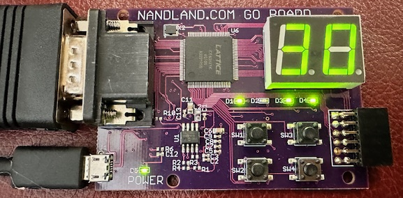

# VGA Pong

A lightweight [VGA](https://vanhunteradams.com/DE1/VGA_Driver/Driver.html) [Pong](https://www.pong-story.com/LAWN_TENNIS.pdf) game in Verilog.



The code runs on a [Nandland Go Board](https://nandland.com/the-go-board/), using 697 (54%) of the 1280 available logic cells in a Lattice iCE40HX1K. The two 7-segment LED displays are used for left/right score keeping.

The code is not optimized in any way, written mostly for readability. It's requires a 25 MHz clock (VGA spec is 25.175 MHz). Max design frequency is 64 MHz.

## Simulation

[Icarus Verilog](http://iverilog.icarus.com/) is used for simulation, specifically, [Icarus Verilog for Windows](https://bleyer.org/icarus/). The test bench is in contained in TestBench.v. Run simulation using:

```
make test
```

## Synthesis

[Project IceStorm](https://clifford.at/icestorm) open source tools were used for synthesis. Synthesis is known to work on [WSL](https://docs.microsoft.com/en-us/windows/wsl/install) Ubuntu running on Windows 11. The following command will perform synthesis and generate the bitstream suitable for programming the FPGA:

```
make
```

USB support on WSL requires [usbipd](https://devblogs.microsoft.com/commandline/connecting-usb-devices-to-wsl) for device programming in WSL. To connect a USB device to WSL Ubuntu, the following commands must be executed from an **administrator** command prompt on Windows:

```
usbipd wsl list
```
```
usbipd wsl attach --busid <busid>
```

Where busid is the appropriate USB bus ID from the wsl list command above. The device should appear in WSL Ubuntu using ```lsusb```.

Alternatively, Windows Powershell in VSCode is quicker. Open a Windows Powershell terminal in VSCode using Terminal | New Terminal and run the following command to list available usb devices:

```
.\usb.bat
```

Then run ```usbipd wsl attach --busid <busid>``` as described above.

The board can be programmed from WSL Ubuntu using:

```
make prog
```
